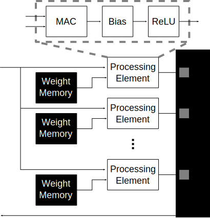

Gobou: 1D Coprocessor
==================================================

Gobou is the coprocessor which is intended to compute 1D layers,
mainly fully-connected layers.
The overall architecture of Gobou is shown in Figure 1 below.

  Figure 1: Block diagram for Gobou

Gobou has distributed processing elements and same number of weight memories.
Weight memories has 

Control Modules
----------------------------------------

