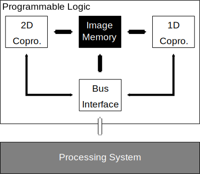

How to edit
==================================================

.. todo:: Format in English

Sphinxドキュメントの文章記法として採用されているreStructuredTextの簡易まとめ．

基本的な文章記法
----------------------------------------

章構成
""""""""""""""""""""""""""""""

文章の章構成は，以下の記号でタイトル下の行をライン付けすることで記述できる．
通常の文章ではセクション以下ぐらいから使うとよさそう．

::

  # 部: オーバーライン付き
  * 章: オーバーライン付き
  =, セクション
  -, サブセクション
  ^, サブサブセクション
  ", パラグラフ

実際の使用例は以下の通り．

::

  ######################################################################
  Part
  ######################################################################

  ************************************************************
  Chapter
  ************************************************************

  ==================================================
  Section (w/ overline)
  ==================================================

  Section (w/o overline)
  ==================================================

  ----------------------------------------
  Subsection (w/ overline)
  ----------------------------------------

  Subsection (w/o overline)
  ----------------------------------------

  ^^^^^^^^^^^^^^^^^^^^^^^^^^^^^^
  Subsubsection (w/ overline)
  ^^^^^^^^^^^^^^^^^^^^^^^^^^^^^^

  Subsubsection (w/o overline)
  ^^^^^^^^^^^^^^^^^^^^^^^^^^^^^^

  """"""""""""""""""""
  Paragraph (w/ overline)
  """"""""""""""""""""

  Paragraph (w/o overline)
  """"""""""""""""""""

インライン要素
""""""""""""""""""""""""""""""

文章中の単語や文節などのインライン要素に対するマークアップは以下の記法
で追加される．

::

  **太字**

  *斜体*

  ``リテラル``

  `リンク付きテキスト <http://python.org>`_

コードブロックの書き方
----------------------------------------

text block begins with ``::`` and
code block begins with ``.. code-block:: <lang>``.

Block Samples
""""""""""""""""""""""""""""""

code blocks by ``python`` and ``ruby``,

.. code-block:: python

  import numpy as np

  array = np.zeros((3, 3, 2), dtype=np.int8)

  print(array)

.. code-block:: ruby

  include 'pp'

  5.times do |i|
    pp i
  end

As a text block (or you can use code blocks of ``c``),

::

  #include <stdio.h>

  int main(void)
  {
    FILE *fp;
    char buf[1024];

    if ((fp = fopen("umakarou.rst", "r")) == NULL) {
      fprintf(stderr, "yasukarou\n");
      exit(1);
    }

    while (fgets(buf, sizeof(buf), fp) != NULL) {
      printf("%s", buf);
    }

    fclose(fp);
    return 0;
  }

by ``systemverilog`` or ``sv``,

.. code-block:: systemverilog

  `include "gobou.svh"

  module relu
    ( input clk
    , input xrst
    , input out_en
    , input signed [DWIDTH-1:0] pixel_in
    , output signed [DWIDTH-1:0] pixel_out
    );

    reg signed [DWIDTH-1:0] r_pixel_in;
    reg signed [DWIDTH-1:0] r_pixel_out;

    assign pixel_out = r_pixel_out;

    always @(posedge clk)
      if (!xrst)
        r_pixel_in <= 0;
      else
        r_pixel_in <= pixel_in;

    always @(posedge clk)
      if (!xrst)
        r_pixel_out <= 0;
      else if (out_en)
        if (r_pixel_in > 0)
          r_pixel_out <= r_pixel_in;
        else
          r_pixel_out <= 0;

  endmodule

数式の書き方
----------------------------------------

Sphinxドキュメントでは，拡張機能としてMathJaxによる数式表示が可能である
（もしくは数式を画像として表示するImgMathを選択出来る）．

**math_number_all**

  もし表示されるすべての数式に番号を振りたい場合，
  このオプションを True にします．デフォルトでは False です．

**:math:**

  インラインの数式のロールです．以下のようにして使用します:

  ::

    ピタゴラスによって， :math:`a^2 + b^2 = c^2` という式が
    成り立つことが示されました．

  **レンダリング結果**

  ピタゴラスによって， :math:`a^2 + b^2 = c^2` という式が
  成り立つことが示されました．

**.. math::**

  数式を表示するディレクティブです．この数式は１行丸ごと使って表示されます．

  このディレクティブは，複数行の等式をサポートしています．
  複数行に記述したい場合には，空行で区切ります:

  ::

    .. math::

    (a + b)^2 = a^2 + 2ab + b^2

    (a - b)^2 = a^2 - 2ab + b^2

  それぞれの数式は分割された環境にセットされます．
  もしも，複数行の等式をきれいに整列させたい場合には，
  \\ で区切って， & 記号を使って整列させます:

  ::

    .. math::

       (a + b)^2  &=  (a + b)(a + b) \\
                  &=  a^2 + 2ab + b^2

  もっと詳しく知りたい場合には AmSMath LaTeX パッケージ
  のドキュメントを参照してください．

  数式が一行のテキストに収まる場合には，ディレクティブの引数として
  記述もできます:

  ::

    .. math:: (a + b)^2 = a^2 + 2ab + b^2

  通常は数式には番号は付きません． もしも数式に対して番号をつけたくなった
  場合には， label オプションを使用してください．
  これが指定されると，数式のラベルを選択できます．この数式のラベルを使って
  クロスリファレンスを作成できます．サンプルを見る場合には eqref を
  参照してください．ナンバリングの形式は出力フォーマットに依存します．

**:eq:**

  数式のラベルに対する，クロスリファレンスを行うためのロールです．
  この機能は，現在では同じドキュメント内でのみ動作します．
  サンプル:

  ::

    .. math:: e^{i\pi} + 1 = 0
      :label: euler

    Euler's identity, equation :eq:`euler`, was elected one of the most
    beautiful mathematical formulas.

  **レンダリング結果**
    .. math:: e^{i\pi} + 1 = 0
      :label: euler

    .. todo:: ラベルが上に来てるのをなんとかする

    Euler's identity, equation :eq:`euler`, was elected one of the most
    beautiful mathematical formulas.

図の貼り方
----------------------------------------

jpg, png, pdf, svgのどれか辺りで貼りましょう．
また、オプションを付けることで大きさなどを調整できます。

**scale**

  画像の縮尺

**width**

  横幅

**height**

  縦幅

**align**

  配置指定”top”, “middle”, “bottom”, “left”, “center”, “right”が使える

**alt**

  代替テキスト

ディレクティブは以下のように書ける:

::

  .. image:: fig/kinpira.svg
    :width: 50%
    :align: center

**レンダリング結果**

箇条書き
----------------------------------------

::

  * This is a bulleted list.
  * It has two items, the second
    item uses two lines.

  1. This is a numbered list.
  2. It has two items too.

  #. This is a numbered list.
  #. It has two items too.

* This is a bulleted list.
* It has two items, the second
  item uses two lines.

1. This is a numbered list.
2. It has two items too.

#. This is a numbered list.
#. It has two items too.

