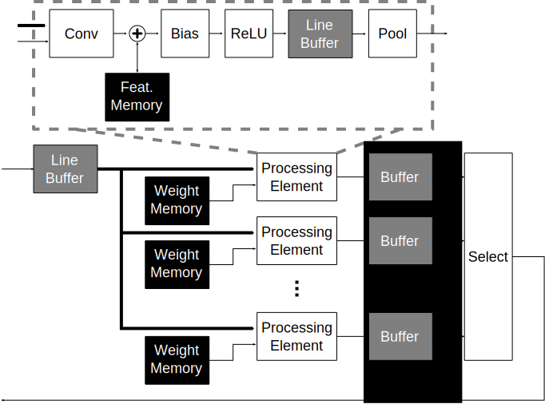
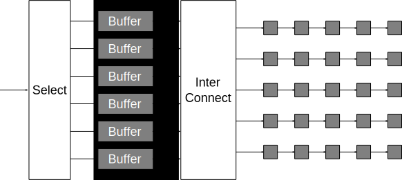

Renkon: 2D Coprocessor
==================================================

Gobou is the coprocessor which is intended to compute 2D layers,
mainly 2D-convolution layers.
The overall architecture of Renkon is shown in Figure 1 below.

  Figure 1: Block diagram for Renkon

Renkon has distributed processing elements and same number of weight memories.
Weight memories has 

  Figure x: Line Buffer architecture for filtering images

hoge

  Figure x: Multiplier-Adder Tree for Conv modules

Control Modules
----------------------------------------

